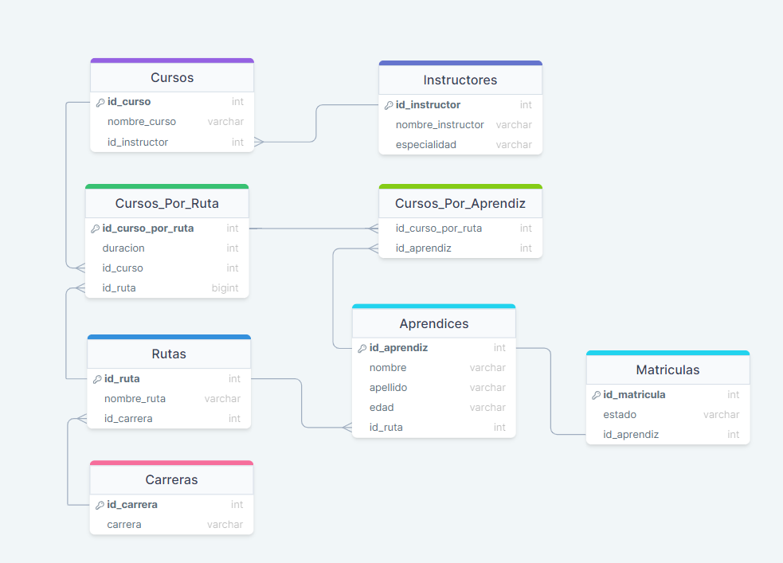
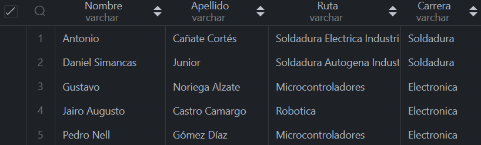
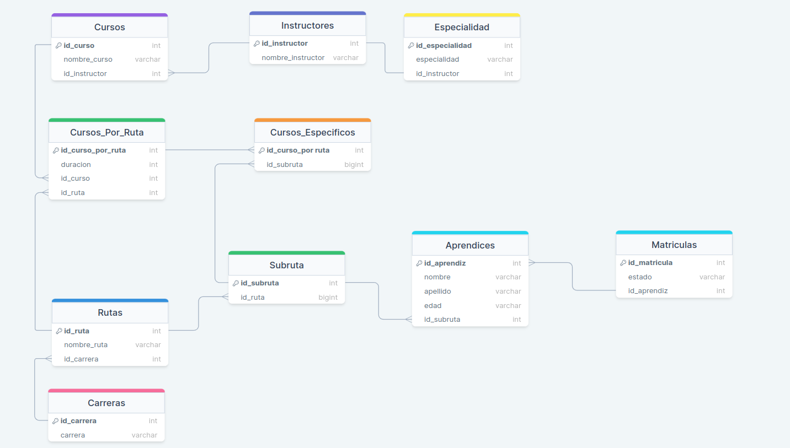
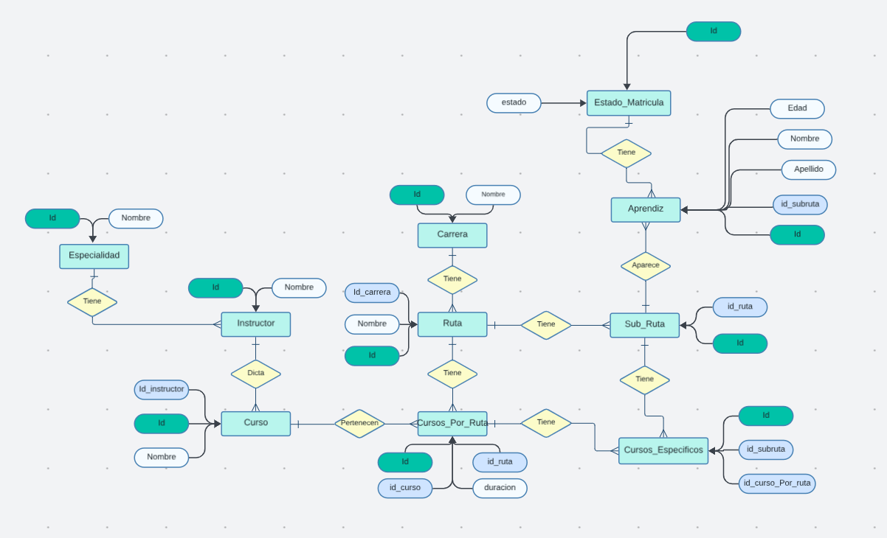

### Proyecto

##### Diagrama Relacional



### Consultas

##### 1. Agregue un campo Estado_Matrícula a la tabla Matrícula que indique si el estudiante se encuentra “En Ejecución”, “Terminado” o “Cancelado”

  ```sql
  DROP TABLE IF EXISTS `Matriculas`;

  CREATE TABLE IF NOT EXISTS `Matriculas`(
    `id_matricula` INT PRIMARY KEY AUTO_INCREMENT,
    `id_aprendiz` INT,
    FOREIGN KEY (`id_aprendiz`) REFERENCES `Aprendices`(`id_aprendiz`)
  )AUTO_INCREMENT=1;

  ALTER TABLE `Matriculas`ADD `estado` VARCHAR(45) NOT NULL AFTER `id_matricula`;

  ```

##### 2. Agregue a el campo edad a la tabla de Aprendices.

  ```sql
  ALTER TABLE `Aprendices` ADD `edad` VARCHAR(3) AFTER `apellido`;
  ```

##### 3. Si suponemos que los cursos tienen una duración diferente dependiendo de la ruta que lo contenga ¿qué modificación haría a la estructura de datos ya planteada?

  ```sql
  ALTER TABLE `Cursos` ADD `duracion` INT NOT NULL AFTER `nombre_curso`;
  ```

##### 4. Seleccionar los nombres y edades de aprendices que están cursando la carrera de electrónica.

  ```sql
  SELECT a.nombre AS Nombre, a.apellido AS Apellido, a.edad AS Edad, c.carrera AS Carrera, m.estado AS Estado
  FROM Matriculas m 
  JOIN Aprendices a ON m.id_aprendiz = a.id_aprendiz
  JOIN Rutas r ON r.id_ruta = a.id_ruta
  JOIN Carreras c ON c.id_carrera = r.id_carrera
  WHERE c.carrera = 'Electronica' AND m.estado = 'Activo';
  ```
##### Sin resultado. Ninguno está cursando, ya todos terminaron o cancelaron.

  ```sql
  SELECT a.nombre AS Nombre, a.apellido AS Apellido, a.edad AS Edad,
  c.carrera AS Carrera, m.estado AS Estado
  FROM Matriculas m 
  JOIN Aprendices a ON m.id_aprendiz = a.id_aprendiz
  JOIN Rutas r ON r.id_ruta = a.id_ruta
  JOIN Carreras c ON c.id_carrera = r.id_carrera
  WHERE c.carrera = 'Electronica';
  ```

##### Resultado


##### 5. Seleccionar Nombres de Aprendices junto al nombre de la ruta de
aprendizaje que cancelaron.

```sql
  SELECT a.nombre AS Nombre, a.apellido AS Apellido, 
  r.nombre_ruta AS Ruta, m.estado AS Estado
  FROM Matriculas m 
  JOIN Aprendices a ON m.id_aprendiz = a.id_aprendiz
  JOIN Rutas r ON r.id_ruta = a.id_ruta
  WHERE m.estado = 'Cancelado';
  ```

##### Resultado


##### 6. Seleccionar Nombre de los cursos que no tienen un instructor asignado.

  ```sql
  SELECT nombre_curso AS Cursos, id_instructor AS Instructores
  FROM Cursos
  WHERE id_instructor IS NULL;
  ```

##### Resultado


##### 7. Seleccionar Nombres de los instructores que dictan cursos en la ruta de aprendizaje “Sistemas de Información Empresariales”.

  ```sql
  SELECT DISTINCT i.nombre_instructor AS Nombre_Instructor, r.nombre_ruta AS Ruta
  FROM Instructores i
  JOIN Cursos c ON i.id_instructor = c.id_instructor
  JOIN Cursos_Por_Ruta cr ON cr.id_curso = c.id_curso
  JOIN Rutas r ON r.id_ruta = cr.id_ruta
  WHERE r.nombre_ruta = 'Sistemas de Informacion Empresariales';
  ```

##### Resultado


##### 8. Genere un listado de todos los aprendices que terminaron una Carrera mostrando el nombre del profesional, el nombre de la carrera y el énfasis de la carrera (Nombre de la Ruta de aprendizaje)

  ```sql
  SELECT a.nombre AS Nombre, a.apellido AS Apellido, r.nombre_ruta AS Ruta, 
  c.carrera AS Carrera
  FROM Matriculas m 
  JOIN Aprendices a ON m.id_aprendiz = a.id_aprendiz
  JOIN Rutas r ON r.id_ruta = a.id_ruta
  JOIN Carreras c ON c.id_carrera = r.id_carrera
  WHERE m.estado = 'Terminado';
  ```
##### Resultado



##### 9. Genere un listado de los aprendices matriculados en el curso “Bases de Datos Relacionales”.

  ```sql
  SELECT a.nombre, a.apellido, c.nombre_curso
  FROM Matriculas m 
  JOIN Aprendices a ON m.id_aprendiz = a.id_aprendiz
  JOIN Cursos_Por_Aprendiz ca ON ca.id_aprendiz = a.id_aprendiz
  JOIN Cursos_Por_Ruta cr ON cr.id_curso_por_ruta = ca.id_curso_por_ruta
  JOIN Cursos c ON c.id_curso = cr.id_curso
  WHERE c.nombre_curso = 'Bases de Datos Relacionales' AND m.estado = "Activo";
  ```

##### Resultado


##### 10. Nombres de Instructores que no tienen curso asignado.

  ```sql
  SELECt DISTINCT i.nombre_instructor, c.id_instructor
  FROM Instructores i
  LEFT JOIN Cursos c ON c.id_instructor = i.id_instructor
  WHERE c.id_instructor IS NULL;
  ```

##### Resultado

  


### Diagramas Finales





------
### Preguntas

#### Pregunta 1:

En el contexto de bases de datos relacionales, explique la diferencia entre las claves primarias y las claves foráneas. Proporcione un ejemplo hipotético de cómo se podrían utilizar ambas claves en un diseño de base de datos.

a) Las claves primarias son utilizadas para establecer relaciones entre tablas, mientras que las claves foráneas garantizan la unicidad de cada registro en una tabla.

b) Las claves primarias son únicas en toda la base de datos, mientras que las claves foráneas establecen relaciones entre tablas.

c) Las claves primarias son necesarias para realizar consultas complejas, mientras que las claves foráneas son opcionales.

d) Las claves primarias y foráneas son términos intercambiables y tienen el mismo propósito en una base de datos.

##### Respuesta correcta: b) Las claves primarias son únicas en toda la base de datos, mientras que las claves foráneas establecen relaciones entre tablas.

#### Pregunta 2:

Explique el concepto de normalización en el diseño de bases de datos. ¿Cuáles son los beneficios de realizar la normalización y cuándo podría ser apropiado desnormalizar una base de datos?

a) La normalización es innecesaria en el diseño de bases de datos modernas. Desnormalizar una base de datos mejora el rendimiento.

b) La normalización es el proceso de organizar los datos para evitar redundancias y dependencias no deseadas. Desnormalizar puede ser apropiado para mejorar el rendimiento en consultas específicas.

c) La normalización solo se aplica a bases de datos pequeñas. Desnormalizar es siempre una mala práctica.

d) La normalización se refiere a la duplicación intencionada de datos para mejorar la velocidad de recuperación. Desnormalizar es necesario para mantener la integridad referencial.

##### Respuesta correcta: b) La normalización es el proceso de organizar los datos para evitar redundancias y dependencias no deseadas. Desnormalizar puede ser apropiado para mejorar el rendimiento en consultas específicas.

#### Pregunta 3:

En el contexto de los diagramas de entidad-relación (ER), defina el término "cardinalidad" y explique cómo se representa en un diagrama. Proporcione un ejemplo práctico de una relación con una cardinalidad específica.

a) La cardinalidad indica la complejidad de un diagrama ER y se representa mediante la cantidad de entidades involucradas. Por ejemplo, una relación "Uno a Uno" implica una cardinalidad de 1.

b) La cardinalidad se refiere a la cantidad máxima de registros en una tabla y se representa con el símbolo "<>" en un diagrama ER. Por ejemplo, una relación "Muchos a Muchos" tiene una cardinalidad de <>.

c) La cardinalidad describe la cantidad de instancias en una entidad que pueden estar asociadas con una instancia en otra entidad. Se representa con líneas y números en un diagrama ER. Por ejemplo, una relación "Uno a Muchos" se representa con un "1" y un "M".

d) La cardinalidad es una propiedad exclusiva de las claves primarias y se representa mediante el uso de llaves en un diagrama ER. Por ejemplo, una relación "Muchos a Uno" se representa con una clave primaria.

##### Respuesta correcta: c) La cardinalidad describe la cantidad de instancias en una entidad que pueden estar asociadas con una instancia en otra entidad. Se representa con líneas y números en un diagrama ER. Por ejemplo, una relación "Uno a Muchos" se representa con un "1" y un "M".

#### Pregunta 4:

Explique la diferencia entre las funciones "INNER JOIN" y "LEFT JOIN" en una consulta SQL. Proporcione un escenario donde sería más apropiado utilizar cada una de estas funciones.

a) "INNER JOIN" devuelve solo los registros que tienen coincidencias en ambas tablas, mientras que "LEFT JOIN" devuelve todos los registros de la tabla izquierda y los registros coincidentes de la tabla derecha. "INNER JOIN" es más apropiado cuando se necesitan todos los registros de ambas tablas.

b) "INNER JOIN" y "LEFT JOIN" son intercambiables y tienen el mismo propósito en una consulta SQL.

c) "INNER JOIN" devuelve todos los registros de la tabla izquierda y los registros coincidentes de la tabla derecha, mientras que "LEFT JOIN" devuelve solo los registros coincidentes. "LEFT JOIN" es más apropiado cuando se desean todos los registros de la tabla izquierda, independientemente de las coincidencias.

d) "INNER JOIN" y "LEFT JOIN" son obsoletos en versiones modernas de SQL y se deben evitar en el diseño de consultas.

##### Respuesta correcta: c) "INNER JOIN" devuelve todos los registros de la tabla izquierda y los registros coincidentes de la tabla derecha, mientras que "LEFT JOIN" devuelve solo los registros coincidentes. "LEFT JOIN" es más apropiado cuando se desean todos los registros de la tabla izquierda, independientemente de las coincidencias.